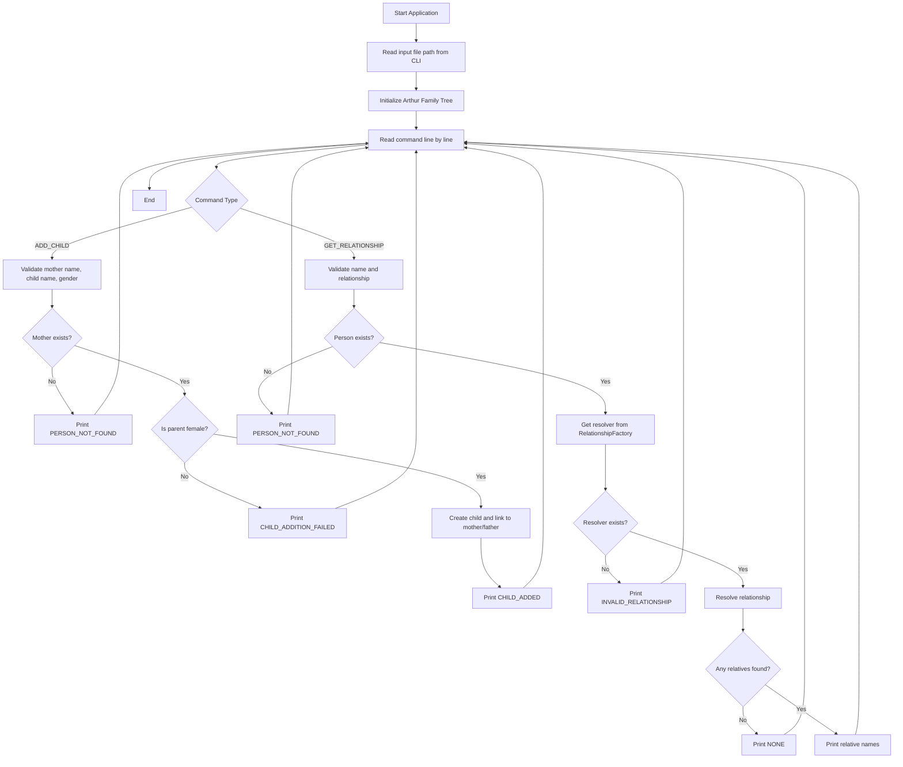
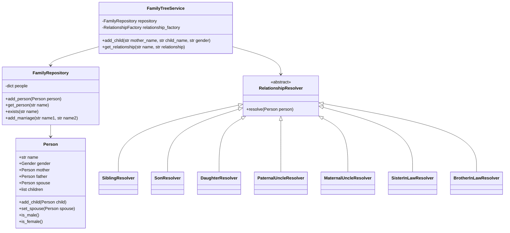

# Flow Diagrams

## Application Flow

```mermaid
flowchart TD
    A[Start Application] --> B[Read input file path from CLI]
    B --> C[Initialize Arthur Family Tree]
    C --> D[Read command line by line]
    D --> E{Command Type}

    E -->|ADD_CHILD| F[Validate mother name, child name, gender]
    F --> G{Mother exists?}
    G -->|No| H[Print PERSON_NOT_FOUND]
    G -->|Yes| I{Is parent female?}
    I -->|No| J[Print CHILD_ADDITION_FAILED]
    I -->|Yes| K[Create child and link to mother/father]
    K --> L[Print CHILD_ADDED]

    E -->|GET_RELATIONSHIP| M[Validate name and relationship]
    M --> N{Person exists?}
    N -->|No| O[Print PERSON_NOT_FOUND]
    N -->|Yes| P[Get resolver from RelationshipFactory]
    P --> Q{Resolver exists?}
    Q -->|No| R[Print INVALID_RELATIONSHIP]
    Q -->|Yes| S[Resolve relationship]
    S --> T{Any relatives found?}
    T -->|No| U[Print NONE]
    T -->|Yes| V[Print relative names]

    H --> D
    J --> D
    L --> D
    O --> D
    R --> D
    U --> D
    V --> D
    D --> W[End]
```

## Architecture

```mermaid
classDiagram
    class Person {
        +str name
        +Gender gender
        +Person mother
        +Person father
        +Person spouse
        +list children
        +add_child(Person child)
        +set_spouse(Person spouse)
        +is_male()
        +is_female()
    }

    class FamilyRepository {
        -dict people
        +add_person(Person person)
        +get_person(str name)
        +exists(str name)
        +add_marriage(str name1, str name2)
    }

    class FamilyTreeService {
        -FamilyRepository repository
        -RelationshipFactory relationship_factory
        +add_child(str mother_name, str child_name, str gender)
        +get_relationship(str name, str relationship)
    }

    class RelationshipResolver {
        <<abstract>>
        +resolve(Person person)
    }

    class SiblingResolver
    class SonResolver
    class DaughterResolver
    class PaternalUncleResolver
    class MaternalUncleResolver
    class SisterInLawResolver
    class BrotherInLawResolver

    RelationshipResolver <|-- SiblingResolver
    RelationshipResolver <|-- SonResolver
    RelationshipResolver <|-- DaughterResolver
    RelationshipResolver <|-- PaternalUncleResolver
    RelationshipResolver <|-- MaternalUncleResolver
    RelationshipResolver <|-- SisterInLawResolver
    RelationshipResolver <|-- BrotherInLawResolver

    FamilyTreeService --> FamilyRepository
    FamilyTreeService --> RelationshipResolver
    FamilyRepository --> Person
```
